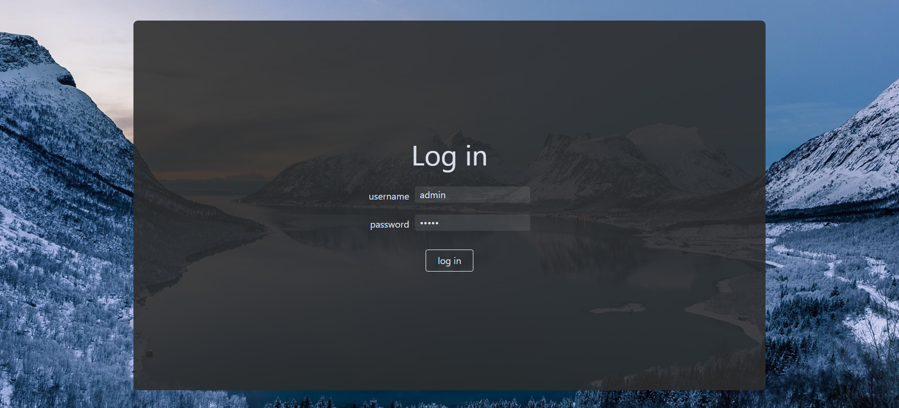
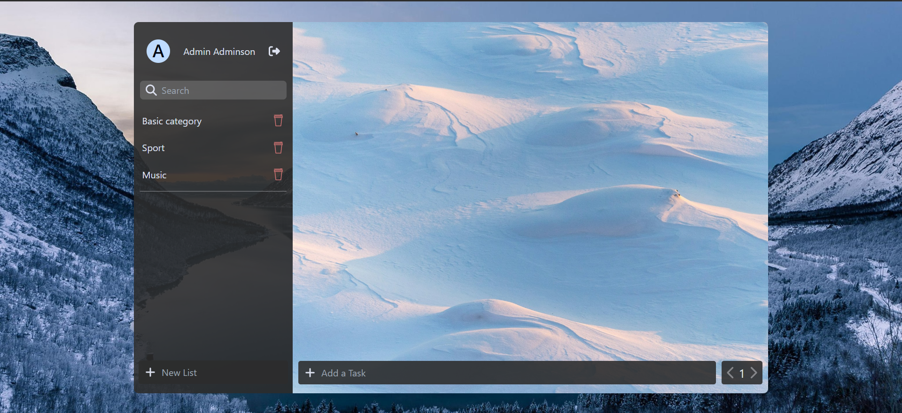
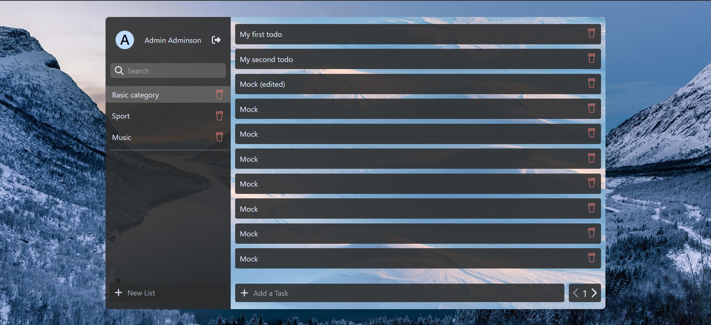
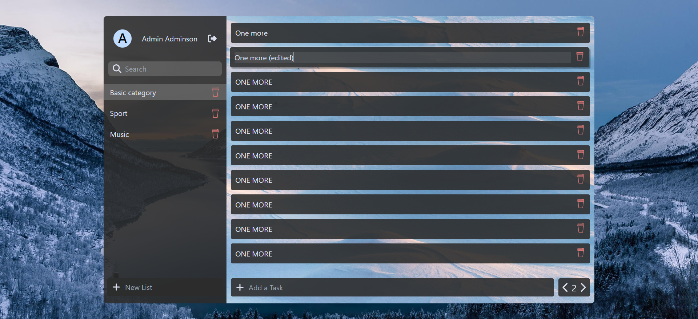
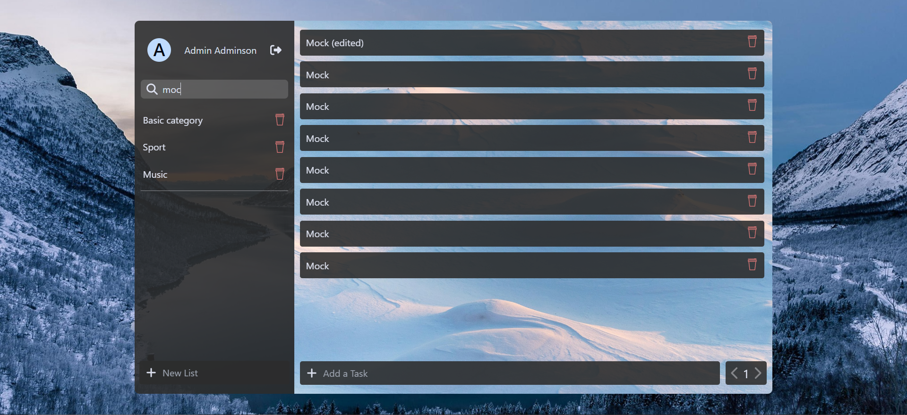

# Todo application (Angular + C#/.NET)

## Login
- username: admin
- password: admin

## Main page

## Category navigation

## Editing
Double click on todo / category.

Then press 'Enter' or click in space to save.

## Searching
Type a name of title (or part of it) in the search field and press the 'Enter' key.
